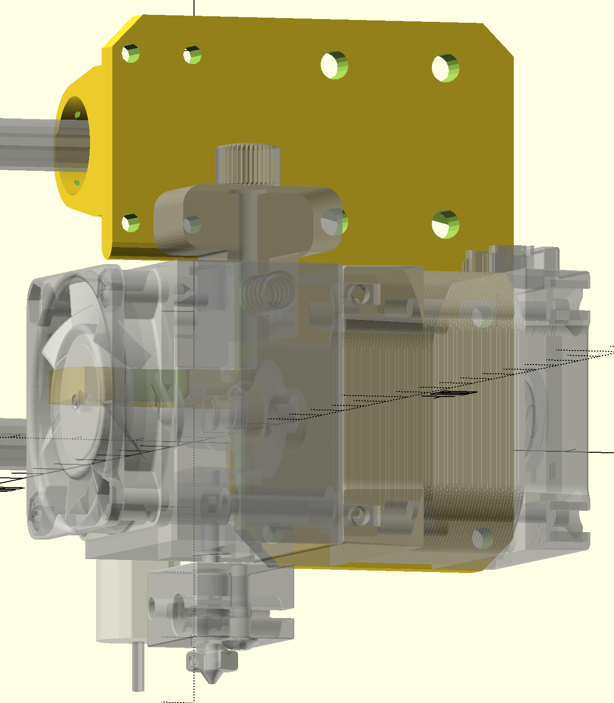

# Hemera Extruder Mounting Plate for Anet A8 - type printers
Designed by Marcus Mendenhall, February, 2020
## Purpose
This project is to develop an very easy-to-use, 3D printable,  adapter plate to mount an [E3D Hemera Extruder](https://e3d-online.com/e3d-hemera) on a 3d printer of the type similar to an Anet A8, Ender 3, or (probably) most Prusa I3-derived printers.

Photograph of the back side of the mount, installed with BLTouch.

Model of the plate in OpenScad showing Hemera and BLTuch ghosted in.  From front.

Annotated image showing some of the features

## Features

The design of plate incorporates a number of critical features. 

1.  The bearing mounting blocks are printed directly onto the plate, greatly reducing the number of screws required to assemble, and the weight.
1. The bottom bearing block is self-aligning.  The design makes it fairly insensitive to the spacing between the guides rods on the printer, and also fairly robust against inaccuracies in the printing itself.  Any rod spacing between 45 mm and 48 mm should work without even modifying the design. This is particularly useful for high-quality, close-fitting bearings such as Igus Drylin, which have little tolerance for misalignment.
1. The design is in [OpenSCAD](https://www.openscad.org), making it very easy to customize.  It is set up with OpenSCAD Customizer-compatible parameters at the top, making simple changes to the design as easy as filling in a dialog box.
1. The plate has an integrated mount for a  [BLTouch bed sensor](https://www.antclabs.com), tightly fit between the Hemera and the guide rods, putting it only 25 mm from the nozzle, with zero x offset.

## Build and use notes
* You can get the Hemera STL from <https://e3d-online.dozuki.com/c/Hemera_CAD> which will appear as a 'ghost' when OpenSCAD visualizes the mount. 
* The tiny holes in the bearing blocks are for brass wire to retain the bearings.  This is a lot easier to use than *#$&^%@ snap rings.
* The "Nozzle High" customizer setting is the one I prefer.  It mounts the Hemera fairly high and well in between the guide rods.  The other setting has it squarely straddling the lower bearing block.
* The square tunnel under the left-hand (looking from the front) bearing block is so that the wiring harness from a BLTouch can pass neatly under.  It has a pair of holes on each side of the tunnel for cable ties to strain-relieve the wiring.
* The screw hole pattern on the right-hand bearing block, which matches the pattern a normal, detached bearing block would have, is for affixing extra items to the frot of the plate.  I use the upper row to attach my cable chain. Note that in the "Nozzle high" position, the lower row of holes is nearly useless, since it is partly covered by the drive motor on the Hemera.
* The odd 'bump' in the bore of the two upper bearing blocks is to keep the seam from the final closure of the bridge from impacting the quality of the bore. 
* The flats on the top and bottom of the bottom bearing block bore is what permits the self-alignment.  These flats allow the bottom bearing some freedom of movement in the direction between the two guide rods, while keeping the bering tightly confined in the perpendicular direction.  
* I printed the one I am currently using with plain PLA, and it works fine.  The Hemera drive motor barely gets warm at 1 amp drive current.  I am printing a second one using an HTPLA, which is probably optimal;  PLA is very rigid and strong, and this plate should be stiff.  If you have a heated enclosure, you probably want HTPLA, but might use ABS instead, which will be slightly flexible. I haven't tried any exotic, very-high-temperature materials.
 
## Status Updates
* As of Feb. 21, 2020, I have been printing using this mount on my printer.   It took about 3 hours from opening the Hemera box until I got my first print.  
* 2020-02-23 Moved screw holes on BLTouch mount out 1 mm to eliminate a collision between the power connector on the BLTouch and the Hemera body.  With them in their previous position, the BLTouch was slightly angled because of this collision. It works fine, nonetheless.
* 2020-02-24 Working on actually documenting the project so it is useful on GitHub
* There are some pictures on Facebook at <https://www.facebook.com/groups/1068531466501015/permalink/2880642818623195/>.  You (unfortunately) have to be a member of the group to see these, so you may have to register.

## License
 [CC BY-NC-SA 4.0](https://creativecommons.org/licenses/by-nc-sa/4.0/)
Non-commercial sharing permitted with attribution.

